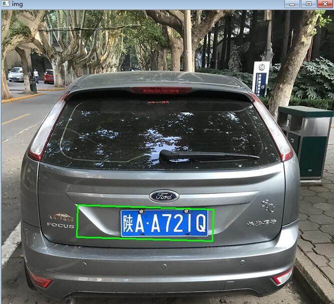
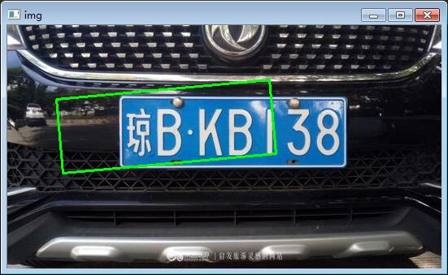
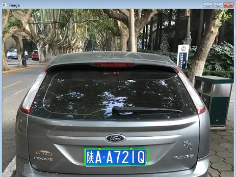
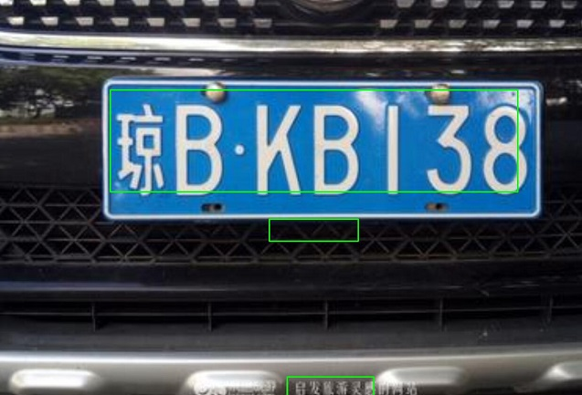
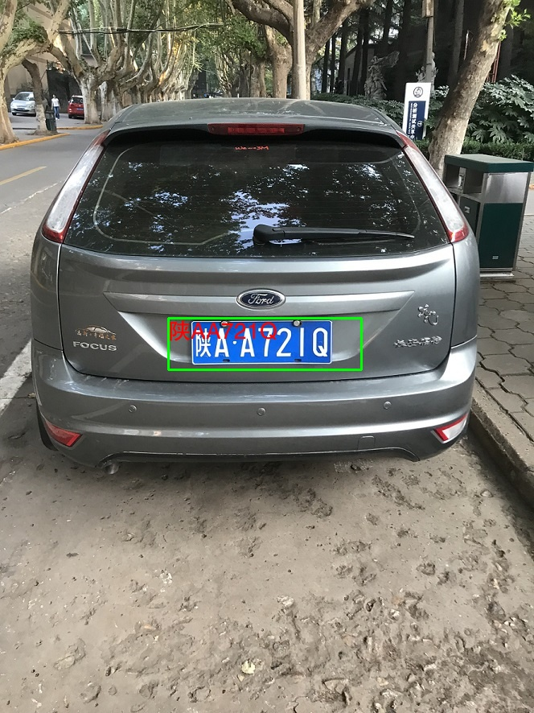
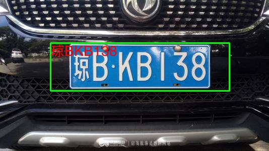
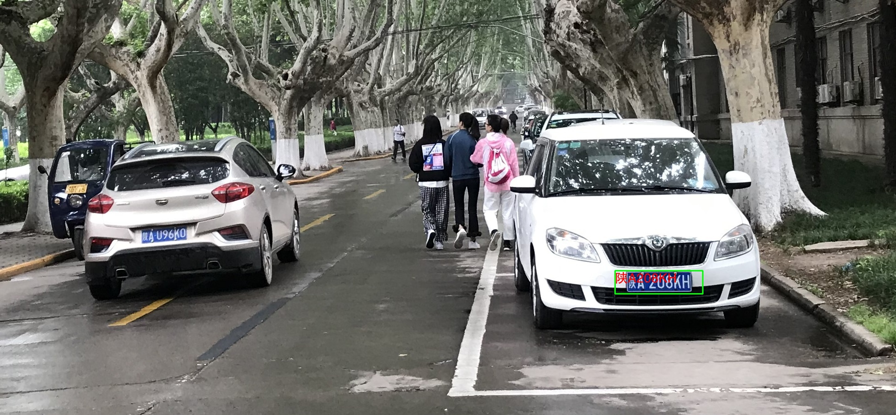
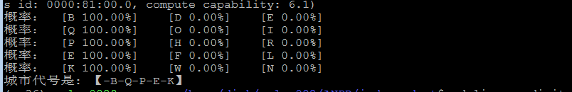
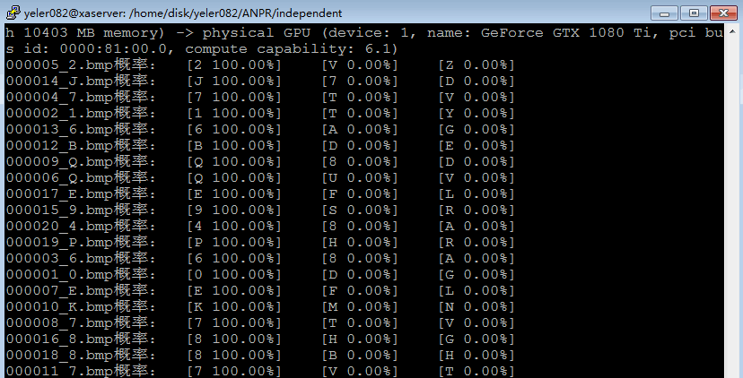

## 项目说明
本项目主要包含以下模块：
#### 车牌的定位
+ 基于opencv-python的定位方法，运行文件location/locate_v1.py

| testing image1        | testing image2    |
| :--------:   | :-----:   | 
| |
可以看出这种定位方法准确率不太理想。

+ 基于HyperLPR模型定位方法,运行文件location/locate_v2.py

| testing image1        | testing image2    |
| :--------:   | :-----:   | 
| |
可以看出这种定位方法准确率有提升，但是仍然会出现错检测与漏检的情况。

#### 车牌端到端的识别
+ 基于HyperLPR第三方组件的方法，运行文件demo.py

    HyperLPR是一个基于Python的使用深度学习针对对中文车牌识别的实现，与其他开源的车牌识别项目相比，它的检测速度和鲁棒性和多场景的适应性都要好于已有框架。
    
    | testing image1        | testing image2    | testing image3    |
    | :--------:   | :-----:   | :-----:   | 
    | ||
    可以看出在高清晰度的图片中，对车牌的检测与识别精度达到了要求。但是还是会出现漏检的缺陷。
    
#### 独立训练分别用于识别数字、字母、省份的识别方法（不含定位）
关于车牌识别有一个分析的思路是，中文车牌主要分为三个部分：
+ part 1:车牌首字符为中文汉字，代表国内各个省份的id
+ part 2:车牌的第二个字符，26个大写字母中的一个
+ part 3:车牌的余下字符，每个位置可能包含26+10种类别

依据上述类别的考虑，接下来分别训练三个分类器，去依次解决这三个部分，实践证明在每个部分的识别准曲率均达到99%。项目代码文件存放在independent文件夹下，
license_digits已经重构成训练和测试代码单独执行。三个部分都公用了相同的训练及测试网络,网络文件为network.py。

环境说明：python3.6  tensorflow-gpu==1.9.0   cuda 8.0

在运行代码之前，需要先把数据集解压到训练脚本所在目录，我的数据集存放位置为ANPR/data/license_plate_dt_v1,首先执行对应的训练，训练完成以后会在
data/output/train_saver 文件夹下生成对应的模型文件

1、在命令行中进入脚本所在目录，输入执行如下命令,确保你在目录independent下：
```
python train-license-province.py train
```
2、然后进行省份简称识别，在命令行输入执行如下命令,确保你在目录independent下：
```
python train-license-province.py predict
```

3、执行城市代号训练（相当于训练26个字母）,确保你在目录independent下
```
python train-license-letters.py train
```
4、识别城市代号,确保你在目录independent下
```
python train-license-letters.py predict
```


5、执行车牌编号训练（相当于训练24个字母+10个数字，我国交通法规规定车牌编号中不包含字母I和O）,确保你在目录independent/license_digits下
```
python train.py
```
6、识别车牌编号
```
python test.py
```

